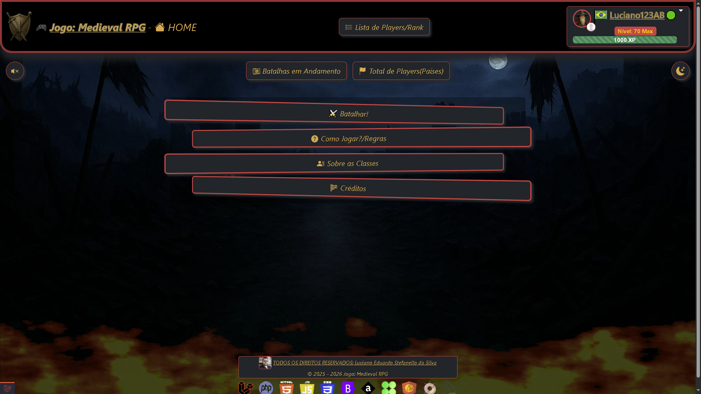
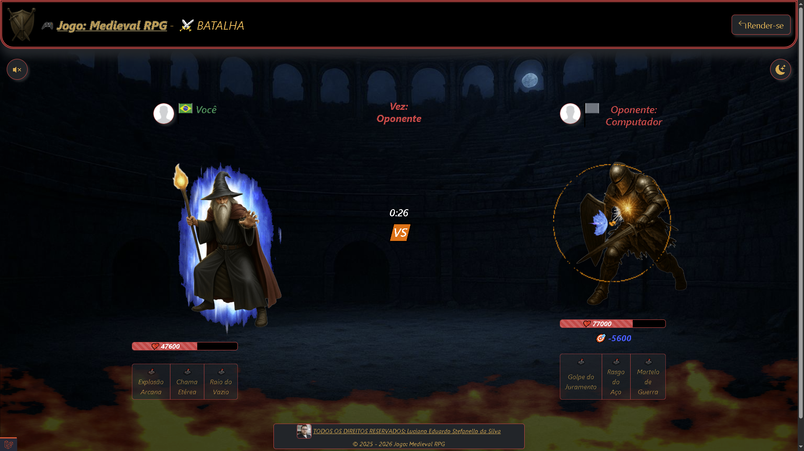

# ⚔️ Jogo RPG (Laravel)

## 📜 Sobre

Aplicação web de RPG por turnos desenvolvida com **Laravel**, com foco em:

- Batalhas PvE e PvP assíncrono.
- Progressão de nível de conta/personagem.
- Ranking global de vitórias/nível.

---

## ✨ Funcionalidades

- Listagens de regras, descrições das classes e créditos.
- Cadastro, login, atualização, mudança de senha e exclusão de player.
- Escolha de classe(Personagem).
- Batalha por turnos contra computador ou outros players.
- Sistema de XP/nível.
- Resete do registro de vitórias e derrotas.
- Listagens de players, batalhas em andamento e totais de players por país.
- Trilha sonora mudo/tocando via sessão.
- Tema escuro/claro via sessão.

---

## 🧱 Stack

- **Backend:** PHP 8.5.3 + Laravel 12
- **Frontend build:** Vite + CSS/JS
- **Banco de dados:** MySQL 8
- **Testes:** Pest/PHPUnit (Feature tests)
- **Containerização:** Docker

---

## 📁 Estrutura Principal

```text
app/
  Console/
    Commands/             # Fluxos automáticos
  Http/    
    Controllers/          # Fluxos principais (cadastro, login, batalha, etc.)
    Middleware/           # Regras de acesso
  Models/                 # Entidades (Player, Batalha, Personagem, ...)
  Services/               # Regras de negócio auxiliares
database/
  migrations/             # Estrutura do banco
  seeders/                # Dados iniciais
public/
  assets/                 # Imagens usadas pelo site (ícones, fundos, etc.)
  fotos/                  # Fotos dos players
  fotos_tmp/              # Fotos temporárias dos players
resources/
  views/                  # Telas Blade
routes/
  web.php                 # Rotas da aplicação
tests/                    # Testes automatizados
```

## 📸 Demonstração




---

## ✅ Pré-Requisitos

- PHP 8.5+
- Composer 2+
- Node.js 20+
- MySQL 8+

---

## 🚀 Como Rodar Localmente

1. Clone o projeto:

```bash
git clone <url-do-repositorio>
cd jogo_rpg
```

2. Instale dependências PHP:

```bash
composer install
```

3. Instale dependências front-end:

```bash
npm install
```

4. Crie o arquivo de ambiente:

```bash
cp .env.example .env
```

5. Gere a chave da aplicação:

```bash
php artisan key:generate
```

6. Configure as variáveis de banco no `.env`.

7. Rode as migrations:

```bash
php artisan migrate
```

8. Rode as seeds:

```bash
php artisan db:seed
```

9. Suba o ambiente de desenvolvimento (server + queue + vite):
 
```bash
composer run dev
```

> O comando acima executa `php artisan serve`, `queue:listen` e `npm run dev` em paralelo.

---
 
## 🧪 Testes

Rodar suíte de testes:
 
```bash
php artisan test
```

Ou via Composer:
 
```bash
composer test
```
 
---

## ⚙️ Variáveis de Ambiente Importantes

Ajuste pelo menos:

- `APP_NAME`, `APP_ENV`, `APP_KEY`, `APP_DEBUG`, `APP_URL`
- `LOG_CHANNEL`, `LOG_LEVEL`
- `DB_CONNECTION`, `DB_HOST`, `DB_PORT`, `DB_DATABASE`, `DB_USERNAME`, `DB_PASSWORD`
- `SESSION_DRIVER`, `SESSION_HTTP_ONLY`, `SESSION_SECURE_COOKIE`
- `CACHE_STORE`
- `QUEUE_CONNECTION`

---

## 🐳 Docker

Este projeto possui `Dockerfile` para facilitar execução/deploy.

Exemplo de build e run:

```bash
docker build -t jogo-rpg .
docker run -p 8000:8000 --env-file .env jogo-rpg
```

Comando de start definido no container:

```bash
php artisan migrate --force && php artisan optimize && php artisan serve --host=0.0.0.0 --port=${PORT:-8000}
```

---

## ☁️ Deploy (Ex.: Railway)

Checklist recomendado:

1. Criar projeto usando o repositório do GitHub.
2. Criar e garantir que o banco MySQL esteja provisionado e acessível.
3. Configurar variáveis de ambiente de produção.
4. Rodar migrations e seeders no deploy (`php artisan migrate --force`, `php artisan db:seed --force`).
 
---

## 🗺️ Roadmap Técnico Sugerido (Melhorias)

- Reforçar autenticação/autorização (policies/guards).
- Evoluir cobertura de testes para fluxos PvP e edge cases.
- Melhorar observabilidade (logs, métricas, alertas).
- Balanceamento de classes e progressão.

---

## 👨‍💻 Autor

Projeto desenvolvido por: **Luciano Eduardo Stefanello da Silva**.